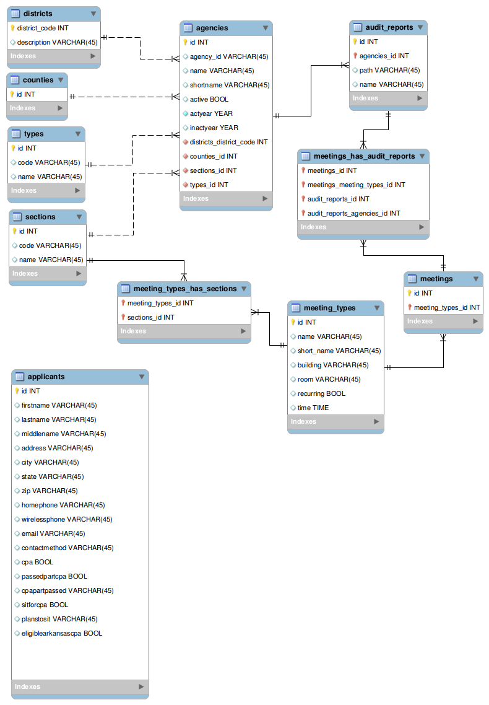

# L. Borealis

Web app for Arkansas Legislative Audit

## The Name

Leuconotopicus borealis, the red-cockaded woodpecker, is an endangered species in Arkansas. It's named after the small red streak on each side of the male's black cap.

## Setup

1. `git clone `__username__`@`__address__`lborealis.git lborealis`
2. `cd lborealis`
3. `composer install`
4. `php artisan key:generate`
5. Create database
6. `cp .env.example .env` and update .env values
8. `php artisan migrate --seed`
9. `php artisan vendor:publish`
10. `php artisan serve` to start the app on [http://localhost:8000/]()

## Purpose

Replacement for the current ASP.NET/C# arklegaudit.gov.

## Description

## Technology

The Laravel framework is open-sourced software licensed under the [MIT license](https://opensource.org/licenses/MIT).
